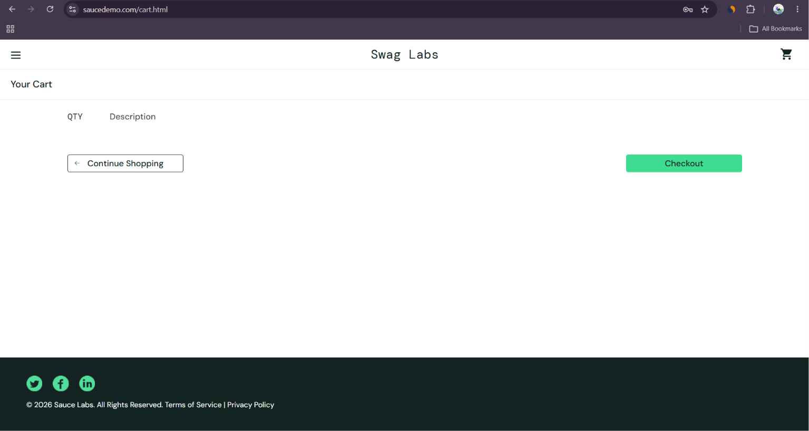

# BUG-001: Checkout is allowed even when cart is empty

## Summary
User is able to proceed to the Checkout process even when the shopping cart is empty.

## Environment
- **Application:** [SauceDemo](https://www.saucedemo.com)
- **Browser:** Google Chrome (latest)
- **OS:** Windows 11
- **User:** standard_user
- **Date Observed:** 2 June 2026

## Preconditions
- User is logged in with valid credentials (`standard_user` / `secret_sauce`)
- Shopping cart is empty (no products added)

## Steps to Reproduce
1. Login to the application using valid credentials.
2. Ensure the cart is empty (do not add any product).
3. Click on the cart icon in the top-right corner.
4. On the Cart page, click the **Checkout** button.

## Expected Result
The Checkout button should be disabled, or the system should display an appropriate error/warning message such as “Your cart is empty” and prevent the user from proceeding further.

## Actual Result
The Checkout button remains enabled. Clicking it navigates the user to the “Checkout: Your Information” page even though the cart contains zero items.

## Severity
**High**

## Priority
**P1**

## Screenshot

## Impact
- Allows users to start the checkout flow without any products, leading to a broken user experience.
- Can cause confusion and reduce trust in the application.
- In a real e-commerce system, this could result in invalid orders or unnecessary load on the checkout process.